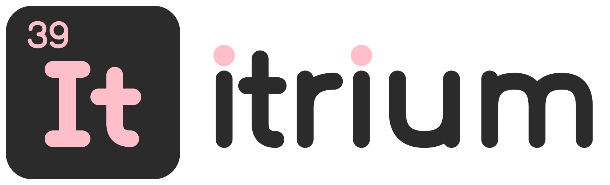

  <picture>
    <source media="(prefers-color-scheme: dark)" srcset="itrium-lockup-on-dark.svg">
    
  </picture>

  <strong>From a quick question to a finished application.</strong> 
  And free tools that leave your data alone.

We help people and small businesses with software, from Indonesia: plain advice, applications
and websites built to order, and free tools that respect your privacy.

## Free tools

- **[Honk](https://github.com/itriumid/honk)**: a lightweight soundboard for the desktop, with
  global hotkeys and a macOS menu bar popover. It makes no network requests at all.

Everything we make for free stays free: no hidden upsell, no account wall and no
advertisements. It doesn't collect, track or sell anything, and it's open source, so you can
check.

---

Itrium is the Indonesian word for yttrium: element 39.
